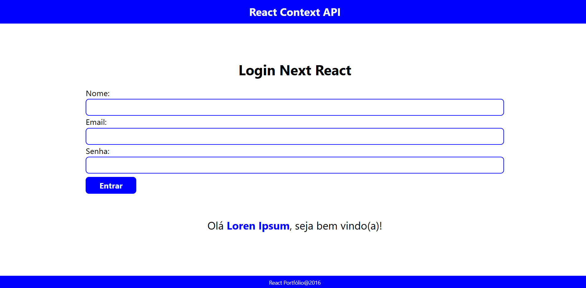

# Login com Context API

## Next.js & React

Acesse o site: [Login Context API](https://albuquerque-katarine.github.io/next-react-login-context-api/)

## Objetivo

Aplicação de login desenvolvida com Next.js e React, utilizando Context API para gerenciamento de estado global.

Demonstra autenticação simples e compartilhamento de dados entre componentes de forma eficiente.

Projeto focado em boas práticas de arquitetura, organização de código e experiência do usuário.

## Finalidade

- Demonstrar autenticação básica em aplicações com Next.js e React
- Utilizar a Context API para gerenciamento de estado global
- Compartilhar dados do usuário entre componentes de forma eficiente
- Aplicar boas práticas de organização e arquitetura de código
- Criar uma interface simples e funcional para login

## Conceitos utilizados

* **Interface:** (TypeScript) definição de tipos 
* **useState:** gerenciamento de estados locais (inputs, login)
* **useContext:** compartilhamento de estado global entre componentes
* **Components:** separação da aplicação em partes reutilizáveis
* **Props:** passagem de dados e funções entre componentes

## Tecnologias

- Next js
- React js
- TypeScript

## Start aplicação em modo de desenvolvimento

- npm run dev

## Contatos

- E-mail: [kba.2879@gmail.com](mailTo:kba.2879@gmail.com)
- Linkedin: [/katarine-albuquerque](https://www.linkedin.com/in/katarine-albuquerque/)